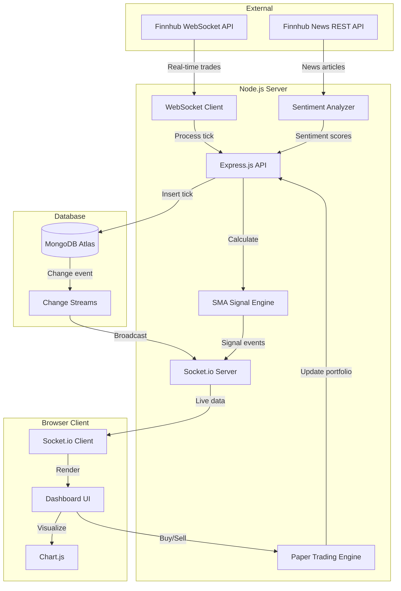

<p align="center">
  
  
  
  
  
  
</p>

# 📈 StockPulse — Real-Time Stock Analytics Dashboard

> A full-stack, real-time stock market analytics platform with **Paper Trading**, **News Sentiment Analysis**, and **Algorithmic Trading Signals** — built with Node.js, MongoDB Change Streams, and WebSockets.

---

## 🎯 Problem Statement

Retail investors and students lack access to affordable, real-time market analysis tools. Existing platforms are either too complex, too expensive, or don't provide hands-on learning opportunities. **StockPulse** bridges this gap by providing:

1. **Real-time market data** streamed directly to the browser
2. **Risk-free paper trading** to learn investing without financial risk
3. **AI-powered sentiment analysis** to understand market-moving news
4. **Algorithmic signals** to learn quantitative trading strategies

---

## ✨ Key Features

### 1. 📊 Real-Time Streaming Dashboard
- Live price updates via **Finnhub WebSocket API**
- Interactive charts with **Chart.js** (50/100/200 data point views)
- Mini sparkline charts for each stock in the watchlist
- Color-coded price movements (green for gains, red for losses)
- Live activity feed showing every trade tick

### 2. 💰 Paper Trading (Virtual Portfolio)
- Start with **$100,000** in virtual currency
- **Buy** and **Sell** any tracked stock at real-time prices
- Real-time **Profit & Loss (P&L)** tracking
- Complete **transaction history** with timestamps
- Portfolio summary bar showing Cash, Holdings, P&L, and Total Value

### 3. 📰 News & Sentiment Analysis
- Fetches latest news articles for each stock via **Finnhub REST API**
- **Keyword-based sentiment analysis** classifies articles as Positive 🟢, Negative 🔴, or Neutral 🟡
- Overall sentiment score for the selected stock
- Falls back to realistic mock news in demo mode

### 4. 🤖 Algorithmic Trading Signals (SMA Crossover)
- Calculates **SMA-10** (Simple Moving Average, 10-period) and **SMA-20** in real-time
- Detects **Golden Cross** (SMA-10 crosses above SMA-20) → **STRONG BUY** 🟢
- Detects **Death Cross** (SMA-10 crosses below SMA-20) → **STRONG SELL** 🔴
- Visual signal badges on every stock card and the main chart
- Toast notifications for strong signal events
- Toggle SMA overlay lines on the main chart

### 5. 🔌 Dynamic Watchlist Management
- Curated dropdown of popular **Stocks** and **Crypto** assets
- Manual search bar to add any custom ticker symbol
- Real-time WebSocket subscription for newly added symbols

---

## 🏗️ System Architecture



---

## 🛠️ Tech Stack

| Layer | Technology | Purpose |
|-------|-----------|---------|
| **Runtime** | Node.js | Server-side JavaScript |
| **Framework** | Express.js | REST API & static file serving |
| **Database** | MongoDB Atlas | Persistent tick storage with TTL indexes |
| **Real-time** | Socket.io | Bi-directional client-server communication |
| **Data Feed** | Finnhub WebSocket | Live market data streaming |
| **Charts** | Chart.js | Interactive price visualization |
| **Streaming** | MongoDB Change Streams | Event-driven data pipeline |
| **Frontend** | Vanilla JS + CSS | Zero-dependency, high-performance UI |

---

## 📁 Project Structure

```
StockPulse/
├── server.js              # Main server (API + WebSocket + Trading Engine)
├── package.json           # Dependencies and scripts
├── .env                   # Environment variables (API keys)
├── .env.example           # Template for environment setup
├── .gitignore
└── public/
    ├── index.html         # Dashboard layout
    ├── css/
    │   └── style.css      # Premium dark-themed UI styles
    └── js/
        └── app.js         # Frontend logic (charts, trading, signals)
```

---

## 🚀 Getting Started

### Prerequisites
- **Node.js** v18+
- **MongoDB Atlas** account (free tier works)
- **Finnhub API Key** (free at [finnhub.io](https://finnhub.io)) — optional, demo mode available

### Installation

```bash
# 1. Clone the repository
git clone https://github.com/Anshchauhanhub/Stockpulse-.git
cd Stockpulse-

# 2. Install dependencies
npm install

# 3. Configure environment
cp .env.example .env
# Edit .env with your MongoDB URI and Finnhub API key

# 4. Start the server
npm start
# or for development
node server.js

# 5. Open in browser
# http://localhost:3000
```

### Environment Variables

| Variable | Description | Required |
|----------|-------------|----------|
| `MONGODB_URI` | MongoDB Atlas connection string | Yes |
| `FINNHUB_API_KEY` | Finnhub API key for live data | No (demo mode) |
| `WATCHLIST` | Comma-separated stock symbols | No (defaults provided) |
| `PORT` | Server port | No (default: 3000) |

> **Note:** Without a Finnhub API key, the app runs in **demo mode** with realistic simulated data — perfect for development and presentations.

---

## 📡 API Endpoints

| Method | Endpoint | Description |
|--------|----------|-------------|
| `GET` | `/api/symbols` | Get watchlist and latest prices |
| `GET` | `/api/stats` | Server statistics (Market Events, uptime, clients) |
| `GET` | `/api/history/:symbol` | Historical tick data from MongoDB |
| `POST` | `/api/watchlist` | Add a new ticker to the watchlist |
| `GET` | `/api/portfolio` | Get portfolio (cash, holdings, P&L) |
| `POST` | `/api/trade` | Execute a paper trade (buy/sell) |
| `GET` | `/api/news/:symbol` | Fetch news with sentiment analysis |
| `GET` | `/api/signals` | Get current SMA signals for all symbols |

---

## 🔬 Technical Highlights (For Evaluators)

### 1. Event-Driven Architecture
The entire data pipeline is event-driven: Finnhub WebSocket → Tick Processing → MongoDB Insert → Change Stream → Socket.io Broadcast → Frontend DOM Update. No polling.

### 2. MongoDB Change Streams
Instead of polling the database, we use **Change Streams** (requires a replica set, which MongoDB Atlas provides) to reactively push new data to connected clients the moment it's persisted.

### 3. SMA Crossover Algorithm
The signal engine maintains a rolling 200-tick price history per symbol and calculates SMA-10 and SMA-20 on every tick. When the short-term average crosses the long-term average, it generates a trading signal — a fundamental strategy used in real quantitative trading.

### 4. Keyword-Based NLP Sentiment Analysis
News headlines are scored against curated dictionaries of positive (e.g., "surge", "beat", "record") and negative (e.g., "crash", "lawsuit", "fraud") financial terms. While simpler than ML-based approaches, it demonstrates the core concept and achieves reasonable accuracy for financial text.

### 5. Zero-Framework Frontend
The entire UI is built with **vanilla JavaScript and CSS** — no React, no Angular, no build tools. This demonstrates a deep understanding of DOM manipulation, WebSocket handling, and CSS architecture without framework abstraction.

---

## 🔮 Future Scope

- **User Authentication** — Login system with JWT for personalized portfolios
- **Machine Learning Sentiment** — Replace keyword analysis with a trained NLP model
- **Multi-Strategy Signals** — Add RSI, MACD, and Bollinger Band indicators
- **Portfolio Persistence** — Save trade history to MongoDB across sessions
- **Mobile Responsive** — Progressive Web App (PWA) for mobile trading
- **Deployment** — Host on Render/Railway for public access

---

## 👥 Contributors

- **Ansh Chauhan** — Full-Stack Developer

---

## 📄 License

This project is built for educational purposes as part of a college PBL (Project-Based Learning) submission.
